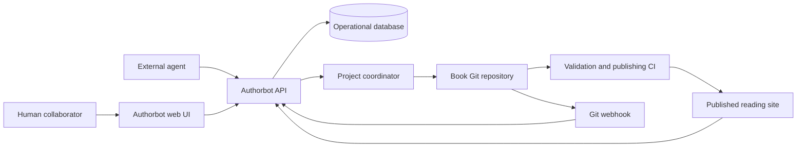
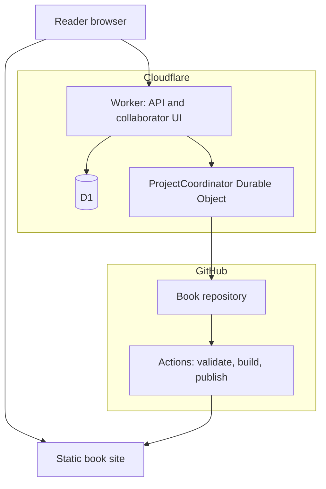
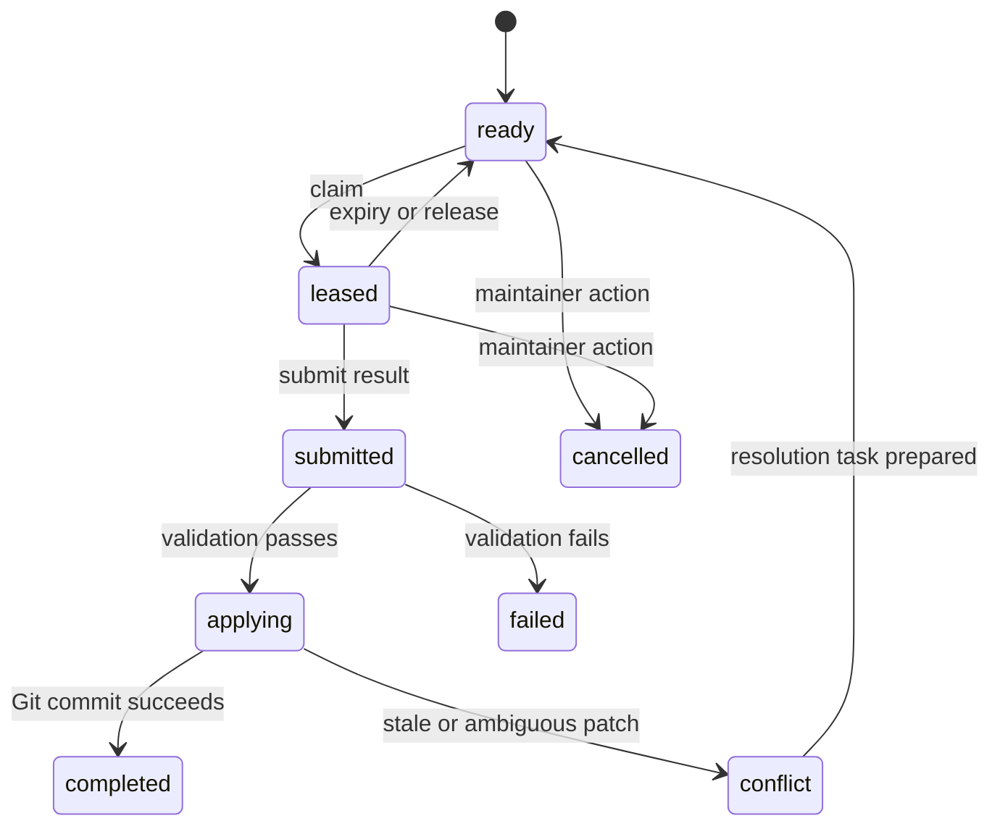

# Authorbot Project Design

**Status:** Draft for implementation  
**Version:** 0.1  
**Date:** 2026-07-19

## 1. Executive summary

Authorbot is a **Git-backed editorial control plane and collaboration protocol for serial books**. It coordinates humans and external agents without invoking an LLM itself. It accepts chapter submissions, annotations, comments, votes, work claims, and completed edits; applies deterministic project rules; preserves attribution and audit history; commits durable literary artifacts to a book repository; and exposes a web interface plus an agent-friendly API.

The strongest product boundary is also the simplest:

> Authorbot manages authorship. It does not perform authorship.

Humans and agents use the same domain model and the same API. Agents discover or subscribe to work, claim it with a lease, perform the work elsewhere, and submit a result. Authorbot validates and integrates that result. There is no model provider, prompt runner, inference scheduler, or hidden agent inside the service.

### 1.1 Recommended v0.1 decisions

| Concern | Decision |
|---|---|
| Application shape | TypeScript monorepo with separable API, publisher, web UI, Git adapter, and shared domain packages |
| Book format | Portable Markdown plus YAML frontmatter and structured YAML or JSON sidecars |
| Durable literary record | Git repository |
| Operational state | SQLite-compatible database; Cloudflare D1 in the preferred hosted deployment |
| Public reading site | Static Astro output, with small interactive islands for collaboration features |
| API runtime | Cloudflare Worker, using a small typed router such as Hono |
| Serialized project commands | Durable Object keyed by project ID, or an equivalent single-writer coordinator |
| Repository authentication | GitHub App installation, not a long-lived personal access token |
| Human authentication | GitHub login initially |
| Agent authentication | Revocable, expiring, scoped bearer tokens; store only hashes |
| Inline anchors | Stable Markdown block ID plus text quote and text position selectors |
| Work reservation | Server-enforced renewable lease, default 30 minutes |
| Concurrent prose updates | Base-revision checks, deterministic re-anchoring, then explicit conflict work |
| Vote transition | Idempotent rule evaluation; one decision and at most one generated work item per accepted suggestion |
| Deployment | Cloudflare Worker, Static Assets, D1, optional Durable Objects; GitHub Actions for validation and publication |
| Initial tenancy | One Authorbot deployment per book project |

### 1.2 The planning term

The writing method being recalled is probably the **Snowflake Method**, not waterfall. Snowflake planning grows a small premise into successively more detailed summaries, character descriptions, scenes, and chapters. Waterfall is a sequential software-delivery model.

Authorbot should not hard-code either method. Its planning model should be a generic **story graph** that can display a snowflake expansion, beat sheet, chapter outline, scene list, or custom hierarchy. The existing novel material already refers to later “snowflake expansion,” so the terminology is consistent with the project you have been developing.

### 1.3 Important correction to the initial concept

Do not rebuild and redeploy the entire site for every vote or comment.

Chapter prose, story-bible documents, accepted decisions, completed work records, and release manifests belong in Git and should trigger validation or publication when appropriate. Live annotations, active vote counts, and leases should be available from the API immediately. Annotation bodies should be mirrored to Git. Raw votes should be exported in batches or summarized when a decision boundary is crossed.

This preserves the Git-backed promise without turning every thumbs-up into a commit, a CI run, and a small administrative tragedy.

## 2. Product definition

### 2.1 Product statement

Authorbot enables a book project to be planned, drafted, reviewed, revised, attributed, and published chapter by chapter by a mixture of humans and external software agents.

It provides:

- A calm public reading site with a chapter index and stable chapter URLs.
- A collaboration mode with inline annotations, chapter-wide discussions, votes, metadata, and revision history.
- A story workspace containing outline or scaffold, timeline, characters, locations, concepts, rules, and continuity notes.
- A deterministic work queue generated by project rules.
- Expiring work leases that prevent accidental parallel edits.
- A versioned HTTP API designed for browsers, command-line clients, and agents.
- Git-backed literary artifacts and provenance.
- CI-driven validation, rendering, and publication.

### 2.2 Primary users

| User | Capabilities |
|---|---|
| Reader | Read released chapters and public collaboration data |
| Contributor | Comment, suggest, reply, and vote when permitted |
| Writer or editor | Claim work and submit chapter or revision results |
| Maintainer | Configure policy, membership, publishing, and overrides |
| Agent | Perform explicitly scoped actions through the API |
| System actor | Create deterministic decisions, work items, and reconciliation events |

### 2.3 Non-goals for v0.1

- Calling an LLM or selecting an LLM provider.
- Real-time Google Docs-style coediting or CRDT synchronization.
- Anonymous public write access.
- A general social network for fiction.
- A full desktop manuscript editor.
- Semantic quality judgments made by Authorbot.
- Automatic prose acceptance merely because a vote threshold was met.
- Multi-tenant SaaS administration.
- Arbitrary user-supplied code in governance rules.
- Attachments, media libraries, or rich layout tooling.

## 3. Design principles

### 3.1 Agent-neutral

Human and agent actions enter through the same commands and produce the same auditable events. Actor type is metadata and a policy input, not a separate universe of special cases.

### 3.2 Git-backed, not Git-deluded

Git is excellent for prose, structured project documents, diffs, releases, attribution, and recovery. It is poor at leases, sessions, idempotency, rapid vote mutation, and transactional queues. Use each system where it is competent. Production has an expensive way of teaching this distinction.

### 3.3 Deterministic core

The core service performs validation, authorization, rule evaluation, state transitions, patch application, Git integration, and publication tracking. None of those activities require generative inference.

### 3.4 Portable book repository

A book remains legible and useful without a running Authorbot instance. Markdown and structured sidecars must remain understandable from the repository alone.

### 3.5 Immutable provenance

Every accepted mutation records who initiated it, which work item or proposal caused it, the base revision, the resulting commit, and the effective policy decision.

### 3.6 Explicit concurrency

All prose writes carry a base revision or precondition. All work claims produce a lease token. Stale writes fail visibly or become conflict-resolution work. They never silently overwrite newer work.

### 3.7 Progressive complexity

The public reading experience should remain as simple as a chapter list plus prose. Collaboration controls appear only to authorized users or when collaboration mode is enabled.

## 4. Terminology

| Term | Meaning |
|---|---|
| Project | One Authorbot configuration connected to one book repository in v0.1 |
| Book repository | Git repository containing chapters, story documents, durable collaboration records, and publishing workflow |
| Chapter | Stable literary unit identified by immutable ID, independent of filename or title |
| Revision | Monotonically increasing chapter revision plus the Git commit that produced it |
| Annotation | Comment or suggestion targeting a chapter range, block, or entire chapter |
| Comment | Discussion that does not itself request a content change |
| Suggestion | Annotation proposing a change and eligible for voting |
| Decision | Recorded result of applying a configured rule to project state |
| Work item | Concrete task that a human or agent may claim |
| Lease | Expiring, renewable server-side reservation for one work item |
| Submission | Candidate chapter or completed work result awaiting validation and integration |
| Story graph | Hierarchical or linked planning nodes such as premise, arc, part, chapter, scene, and beat |
| Story bible | Characters, locations, concepts, world rules, terminology, and continuity facts |
| Projection | Query-optimized database representation derived from Git artifacts and API events |
| Git operation | Serialized attempt to create a multi-file commit and advance the configured branch |

## 5. System context



### 5.1 Three planes

#### Content plane

The book repository stores prose, story documents, durable annotations, decisions, completed work records, attribution, and releases.

#### Coordination plane

The API and operational database store sessions, token hashes, active leases, mutable votes, idempotency records, projections, Git operation state, and publication state.

#### Presentation plane

The published site serves static chapter content and story views. Interactive islands fetch current annotations, vote counts, work status, and permissions from the API.

### 5.2 Recommended deployment topology



The static site may live on Cloudflare Workers Static Assets, Cloudflare Pages, or GitHub Pages. The API does not depend on the static host.

## 6. Component architecture

### 6.1 Suggested monorepo

```text
authorbot/
├── apps/
│   ├── api/                  # HTTP API, auth, commands, webhooks
│   ├── web/                  # collaborator UI and shared reading components
│   └── docs/                 # optional product documentation
├── packages/
│   ├── domain/               # entities, commands, events, state machines
│   ├── schemas/              # Zod and JSON Schema definitions
│   ├── database/             # migrations and repositories
│   ├── git-github/           # GitHub App and Git Data API adapter
│   ├── repo-coordinator/     # serialized multi-file commit workflow
│   ├── markdown/             # parser, block IDs, selectors, patching
│   ├── publisher/            # book repository to static site build
│   ├── rule-engine/          # declarative deterministic rules
│   ├── api-client/           # generated or typed client
│   └── test-fixtures/
├── templates/
│   └── book-repo/
├── migrations/
├── openapi/
├── schemas/
├── docs/adr/
├── wrangler.jsonc
├── pnpm-workspace.yaml
└── package.json
```

### 6.2 Responsibilities

#### API

- Authenticate human sessions and agent tokens.
- Authorize project operations.
- Validate command payloads.
- Enforce idempotency and preconditions.
- Execute database state transitions.
- Invoke serialized Git operations.
- Expose read projections, events, and operation status.
- Verify and process GitHub webhooks.

#### Domain package

- Pure state machines and invariants.
- No Cloudflare, GitHub, browser, or database dependencies.
- Exhaustive unit tests around concurrency and transition rules.

#### Project coordinator

- Serialize mutation commands per project.
- Coordinate lease claims and renewal races.
- Read the current Git branch head.
- Build a new tree containing all related file changes.
- Create one Git commit for one logical mutation.
- Advance the branch ref without force.
- Retry against a moved head or produce a conflict.
- Record operation result and correlation IDs.

A Durable Object keyed by project ID is a strong hosted implementation. A database-backed queue with one consumer per project is an acceptable portable alternative.

#### Markdown package

- Parse Markdown into an AST.
- Validate frontmatter.
- Assign or preserve stable block IDs.
- Produce normalized plain-text streams for selection offsets.
- Resolve annotation selectors.
- Determine whether a selection maps to a safe source span.
- Apply range or block replacements without altering unrelated text.
- Render sanitized HTML.

#### Publisher

- Read and validate a book repository.
- Build chapter index and chapter pages.
- Build outline, timeline, character, location, and work views.
- Embed deployed commit metadata.
- Emit static assets and client configuration.

## 7. Source-of-truth model

### 7.1 Canonical in Git

- Chapter Markdown and chapter metadata.
- Story graph and story bible.
- Public-safe project configuration.
- Annotation and reply bodies.
- Decision records.
- Work-item specifications and final disposition.
- Attribution records.
- Release manifests.

### 7.2 Canonical in the operational database

- Human sessions.
- Agent token hashes, scopes, expiration, and revocation.
- Active leases and lease-token hashes.
- Raw mutable votes and vote-event history.
- Idempotency keys and response fingerprints.
- Current query projections.
- Pending Git operations and outbox records.
- Webhook delivery deduplication.
- Publication and deployment status.
- Rate-limit counters.

### 7.3 Mirroring policy

Annotations and replies are accepted as commands, written to the operational store as `pending_git`, and placed into the repository coordinator. They may appear immediately to their author with a syncing badge. They become normal project records once the Git commit succeeds.

Raw votes should not create one commit per click. When a proposal crosses a decision boundary, Authorbot writes a decision record containing the rule version, aggregate result, privacy-safe voter information, and generated work-item ID. Projects may enable periodic full or pseudonymous vote-event export.

### 7.4 Publication-trigger policy

CI workflows should use path filters:

- `chapters/**`, `story/**`, `book.yml`, or publisher configuration trigger a public rebuild.
- `.authorbot/decisions/**`, completed work, releases, or attribution may trigger a rebuild when those records are shown publicly.
- `.authorbot/annotations/**` can run validation without rebuilding the book.
- Raw vote snapshots never need to trigger publication.

### 7.5 Rebuildability

The database projection must be rebuildable from:

1. The current repository tree.
2. Durable collaboration records under `.authorbot/`.
3. Git history where revision provenance is required.
4. A separate operational backup for credentials, current votes, idempotency records, and active leases.

A projection rebuild does not need to restore expired leases or browser sessions.

## 8. Book repository contract

### 8.1 Proposed layout

```text
book-repo/
├── book.yml
├── README.md
├── chapters/
│   ├── 001-opening.md
│   └── ...
├── story/
│   ├── outline.yml
│   ├── timeline.yml
│   ├── characters/
│   ├── locations/
│   ├── concepts/
│   ├── rules/
│   └── style-guide.md
├── .authorbot/
│   ├── annotations/<annotation-id>/
│   │   ├── annotation.md
│   │   └── replies/
│   ├── decisions/
│   ├── work-items/
│   │   ├── open/
│   │   ├── done/
│   │   ├── cancelled/
│   │   └── conflicts/
│   ├── attribution/
│   ├── releases/
│   └── exports/
├── schemas/                 # optional pinned schema copies
└── .github/workflows/
    ├── validate.yml
    └── publish.yml
```

### 8.2 `book.yml`

```yaml
schema: authorbot.book/v1
id: 0190f27c-6e65-7ca5-a596-9f093d577aba
title: Example Serial
slug: example-serial
language: en-US
license: CC-BY-NC-4.0
repository:
  default_branch: main
content:
  chapters_glob: chapters/*.md
  raw_html: false
planning:
  method: custom
  outline: story/outline.yml
  timeline: story/timeline.yml
  characters_glob: story/characters/*.md
publication:
  chapter_url: /chapters/{slug}/
  show_revision: true
  show_attribution: true
  show_public_annotations: true
```

Secrets, GitHub App installation IDs, agent tokens, webhook secrets, and deployment credentials never belong in this file.

### 8.3 Chapter format

```markdown
---
schema: authorbot.chapter/v1
id: 0190f27d-8ea5-7e43-a6f2-64d6939ff3b4
slug: opening
title: Opening
order: 10
status: published
revision: 4
published_at: 2026-07-19T18:00:00Z
authors:
  - actor: github:octocat
summary: A concise summary for navigation and agent context.
timeline_refs:
  - event:first-contact
character_refs:
  - character:protagonist
---

<!-- authorbot:block id="0190f27e-1a93-7b61-996a-9f94849d27a8" -->
The first paragraph begins here.
```

Stable block markers are HTML comments so ordinary Markdown renderers ignore them. The publisher may repair missing IDs in an explicit command, but normal edits that remove IDs should fail validation rather than quietly erasing annotation anchors.

### 8.4 Block rules

A block ID belongs to one semantic Markdown block: paragraph, heading, list item, blockquote paragraph, code block, or table row. IDs remain stable when surrounding content moves.

For v0.1:

- Inline comments may target any single block range.
- Automated `range_replacement` is allowed only when the rendered selection maps to one contiguous source span.
- Selections crossing blocks or Markdown formatting boundaries may generate a `revise_block` or `revise_chapter` task instead.
- Chapter-level comments and suggestions require no text selector.

This restriction is less glamorous than corrupting Markdown in production, which is why it is recommended.

### 8.5 Story graph

The outline uses stable nodes rather than encoding one writing doctrine.

```yaml
schema: authorbot.story-graph/v1
nodes:
  - id: premise:main
    type: premise
    title: Core premise
    summary: One sentence.
    order: 10
  - id: part:one
    type: part
    title: Part One
    parent: premise:main
    order: 20
  - id: chapter:opening
    type: chapter
    chapter_id: 0190f27d-8ea5-7e43-a6f2-64d6939ff3b4
    parent: part:one
    order: 30
    status: published
  - id: scene:opening-lab
    type: scene
    parent: chapter:opening
    order: 40
    goal: Establish the anomaly.
    conflict: The apparatus disagrees with itself.
    outcome: The team repeats the experiment.
links:
  - from: scene:opening-lab
    to: concept:causal-projector
    type: introduces
```

A Snowflake view can show premise, paragraph summary, character synopses, chapters, and scenes. A beat-sheet view can filter the same nodes by `type: beat` and template tags.

### 8.6 Timeline

Fiction may use dates, relative time, or custom calendars. Store a sortable value separately from its display label.

```yaml
schema: authorbot.timeline/v1
calendar:
  type: relative
  epoch_label: Project Day 0
events:
  - id: event:first-contact
    sort_key: 120800
    display_time: Project Day 12, 08:00
    title: First stable contact
    participants: [character:protagonist]
    locations: [location:main-lab]
    chapter_refs:
      - 0190f27d-8ea5-7e43-a6f2-64d6939ff3b4
    facts:
      - The chamber is under negative pressure.
```

## 9. Domain model

### 9.1 Core entities

#### Project

`id`, `slug`, repository provider and coordinates, default branch, status, configuration version, and deployment settings.

#### Actor

`id`, `type` (`human`, `agent`, or `system`), display name, external identity, optional owning human for agents, and status.

#### ProjectMembership

`project_id`, `actor_id`, role, vote group, scopes, created time, and revocation time.

#### ChapterProjection

Chapter ID, repository path, slug, title, state, revision, content hash, head commit, and last published commit.

#### Annotation

ID, kind, scope, chapter ID and revision, selectors, author, body path, status, vote summary, created time, and superseded-by reference.

#### Reply

ID, annotation ID, parent reply ID, author, body path, status, and timestamps.

#### Vote

Annotation ID, actor ID, value, optional weight, created time, and updated time. There is one current vote per actor per annotation.

#### Decision

ID, source annotation, rule and version, aggregate metrics, result, generated work item, effective time, and optional override reason.

#### WorkItem

ID, type, status, source annotation, target document, base revision, priority, acceptance criteria, and current lease reference.

#### Lease

ID, work item, holder, token hash, issue time, expiration, renewal count, maximum expiration, and revoked time.

#### Submission

ID, work item or chapter target, actor, base revision, payload type, content hash, validation result, integration commit, and state.

#### GitOperation

ID, project, command correlation ID, expected branch head, proposed files, state, attempts, commit SHA, and failure details.

#### AuditEvent

Immutable event ID, project, actor, action, target, timestamp, request correlation, and safe metadata.

### 9.2 Suggested operational tables

```text
projects
actors
project_memberships
human_sessions
agent_tokens
chapters
annotations
replies
votes
vote_events
decisions
work_items
leases
submissions
git_operations
outbox
idempotency_keys
webhook_deliveries
releases
audit_events
```

Critical constraints:

- Unique current vote on `(annotation_id, actor_id)`.
- Unique generated action on `(source_annotation_id, action_type, rule_version)`.
- Exactly one active lease per work item.
- Unique idempotency key on `(project_id, actor_id, key)` with a stored request hash.
- Unique webhook delivery ID.
- Monotonic chapter revisions.

### 9.3 Chapter states

`draft -> proposed -> published -> archived`

A revision may be made to any non-archived chapter. Publishing is separate from committing, so a chapter can be integrated before it is publicly released.

### 9.4 Annotation states

```text
open
  -> work_item_created
  -> accepted
  -> resolved
  -> rejected
  -> withdrawn
  -> superseded
  -> orphaned
```

Substantive edits after the first vote create a new annotation revision or a superseding annotation and reset voting. Otherwise people would vote on one proposal and receive another, a governance trick with a regrettably established human history.

### 9.5 Work-item states



## 10. Annotation targeting and re-anchoring

### 10.1 Target payload

A range annotation stores independent selectors:

```json
{
  "chapterId": "0190f27d-8ea5-7e43-a6f2-64d6939ff3b4",
  "chapterRevision": 4,
  "blockId": "0190f27e-76db-79c2-a455-a16916f79126",
  "textPosition": { "start": 118, "end": 163 },
  "textQuote": {
    "exact": "the text selected by the contributor",
    "prefix": "roughly 32 normalized characters before ",
    "suffix": " and roughly 32 normalized characters after"
  }
}
```

The position is measured in a normalized plain-text stream generated from the Markdown AST, not raw HTML offsets.

### 10.2 Resolution order

When rendering against a newer revision:

1. Match the stable `blockId`.
2. Try the stored position in that block and verify the exact quote.
3. Search for exact quote plus prefix and suffix in the block.
4. Search for exact quote plus context in the chapter.
5. Apply bounded fuzzy matching only when one candidate is clearly superior.
6. Mark the annotation `orphaned` or `needs_reanchor` when no confident match exists.

Never silently attach an annotation to a merely similar sentence. Misplaced editorial comments are more dangerous than visible orphans because they look authoritative while lying.

### 10.3 Edit effects

- An accepted suggestion retains its original target snapshot.
- Unrelated annotations are re-anchored to the new revision.
- Annotations overlapping replaced text are flagged for review unless a deterministic mapping exists.
- Each re-anchor result records algorithm version and confidence.
- A manual re-anchor is auditable.

## 11. Voting and deterministic rules

### 11.1 Rule model

Rules are declarative data. Do not evaluate JavaScript, templates, or arbitrary expressions from the book repository.

```yaml
rules:
  suggestion_to_work_item:
    version: 1
    trigger: vote_changed
    when:
      all:
        - { metric: approvals, operator: gte, value: 3 }
        - { metric: net_score, operator: gte, value: 2 }
        - { metric: human_approvals, operator: gte, value: 1 }
    action:
      type: create_work_item
      work_type: revise_range
```

Supported metrics should remain small and explicit:

- approvals, rejections, and abstentions
- net score or weighted score
- distinct voters
- human or agent approvals
- approvals by role or trust group
- proposal age
- maintainer veto or override

### 11.2 Default governance

Recommended safe default:

- Three approvals.
- Net score at least two.
- At least one human approval.
- Registered collaborators only.
- One current vote per actor.
- Agents cannot vote unless their project membership grants it.
- A maintainer may reject, cancel, reopen, or force-create work with a recorded reason.

This prevents a fleet of newly minted API tokens from manufacturing consensus, a failure mode that would otherwise arrive minutes after someone notices it is possible.

### 11.3 Threshold behavior

Crossing the threshold creates a sticky decision and one work item. Later vote changes do not delete work already created. Instead:

- Mark the decision `support_changed` when the current aggregate no longer satisfies the rule.
- Surface the changed support to the claimant and maintainer.
- Allow a maintainer to cancel before integration with a reason.
- Preserve the original threshold-crossing snapshot.

### 11.4 Idempotency

A unique constraint on `(source_annotation_id, action_type, rule_version)` prevents duplicate work items. Rule evaluation and decision creation occur in one serialized command.

## 12. Work leases and editing

### 12.1 Lease semantics

A lease is not a visual flag. It is a server-enforced capability.

```yaml
leases:
  duration: PT30M
  renewal_prompt_before: PT5M
  renewal_duration: PT30M
  maximum_total_duration: PT4H
```

### 12.2 Claim

`POST /work-items/{id}/claim` performs a serialized compare-and-set:

1. Confirm the work item is ready, or its prior lease is expired.
2. Confirm the actor has permission and matching capability.
3. Create an opaque random lease token.
4. Store only its hash.
5. Return the token once with `lease_id`, `expires_at`, task bundle, and base revision.
6. Transition the item to `leased`.

Two simultaneous claims must produce exactly one success.

### 12.3 Renewal

A browser prompts five minutes before expiration. An agent calls the same renewal endpoint directly. Renewal requires the current lease token and cannot exceed the configured maximum total duration.

### 12.4 Expiration

Expiration is enforced lazily on every relevant command and eagerly by a scheduled alarm or sweep. No submission is accepted merely because the browser still displays a reassuring countdown.

### 12.5 Submission

A completed edit includes:

- work item ID
- lease ID and lease token
- idempotency key
- base chapter revision and base content hash
- submission type
- replacement or full document content
- optional summary and test notes

The server verifies holder, token, expiry, work-item state, base revision, and payload schema before applying anything.

### 12.6 Conflict policy

A lease prevents two people from holding the same task, but it does not freeze the chapter against unrelated edits.

When a submission arrives:

1. If current revision equals base revision, validate and apply.
2. If the chapter changed, resolve the stored block and quote against the new text.
3. If the target remains unique and changed regions do not overlap, rebase and apply.
4. If mapping is ambiguous or overlapping, create a conflict-resolution work item and return `409 Conflict`.
5. Never clobber the newer chapter.

## 13. Work-item artifact

A durable work-item Markdown file contains machine-readable frontmatter and human-readable context.

```markdown
---
schema: authorbot.work-item/v1
id: 0190f301-7045-7b2d-9d91-95b3c8228b54
type: revise_range
status: ready
source_annotation_id: 0190f300-2f7e-7467-b288-5e3c5a4bd991
chapter_id: 0190f27d-8ea5-7e43-a6f2-64d6939ff3b4
base_revision: 4
priority: normal
created_by: system:rule-engine
created_at: 2026-07-19T18:20:00Z
---

## Context

Why the task exists and the story context required to do it.

## Original text

<!-- authorbot:original:start -->
Exact original text.
<!-- authorbot:original:end -->

## Requested change

The voted proposal, without pretending it is already the final prose.

## Acceptance criteria

- Preserve point of view.
- Change only the selected span.
- Keep continuity facts intact.

## Submission contract

Submit a `range_replacement` against chapter revision 4 while holding the current lease.
```

The current lease does not belong in Git because it expires rapidly and contains sensitive capability material.

## 14. Git integration

### 14.1 Authentication

Use a GitHub App installed on the selected repository. Request only the permissions required for repository contents, metadata, and webhooks. Create short-lived installation tokens for each operation.

### 14.2 Atomic logical commits

One accepted literary mutation may update several files:

- chapter content and revision
- annotation state
- decision record
- work-item state
- attribution record
- release or publication metadata

Those files should land in one commit. Use the Git Data API sequence:

1. Read branch ref and current commit.
2. Create required blobs.
3. Create a tree based on the current tree.
4. Create a commit with the current commit as parent.
5. Update the branch ref with force disabled.
6. If the head moved, reload, revalidate, and retry a bounded number of times.
7. Produce an explicit conflict when semantic preconditions no longer hold.

Do not make a series of one-file Contents API calls for a mutation that must be atomic.

### 14.3 Commit metadata

Use a clear subject and structured trailers:

```text
Apply work item 0190f301-7045-7b2d-9d91-95b3c8228b54

Authorbot-Actor: github:example-editor
Authorbot-Work-Item: 0190f301-7045-7b2d-9d91-95b3c8228b54
Authorbot-Annotation: 0190f300-2f7e-7467-b288-5e3c5a4bd991
Authorbot-Base-Revision: 4
Authorbot-Operation: 0190f302-...
```

Git's author or committer identity should represent the Authorbot service, while attribution records preserve the actual human or agent actor. This avoids forged Git identities and still gives readers accurate credit.

### 14.4 Direct mode and pull-request mode

Use direct-to-main mode in v0.1 with non-force updates and strict validation. Add pull-request mode later for projects that require external review or protected-branch rules.

### 14.5 External repository changes

Git webhooks trigger reconciliation:

- Ignore already processed delivery IDs.
- Validate changed book files.
- Update chapter and story projections.
- Re-anchor annotations.
- Detect revisions made outside Authorbot.
- Mark the project `invalid` or `diverged` when repository invariants are broken.
- Block prose writes until invalid state is repaired, but continue safe reads.

## 15. API design

### 15.1 Conventions

- Prefix endpoints with `/v1`.
- Use UUIDv7 identifiers.
- Use UTC RFC 3339 timestamps.
- Require `Idempotency-Key` on mutation endpoints.
- Use ETags and `If-Match` for editable resources.
- Return `application/problem+json` errors.
- Use cursor pagination.
- Expose correlation and operation IDs.
- Publish OpenAPI 3.1 and generate a client.
- Treat API requests from humans and agents identically after authorization.

### 15.2 Endpoint outline

#### Identity and project

```text
GET    /v1/me
GET    /v1/projects/{projectId}
GET    /v1/projects/{projectId}/members
POST   /v1/projects/{projectId}/agent-tokens
DELETE /v1/projects/{projectId}/agent-tokens/{tokenId}
```

#### Chapters and story documents

```text
GET  /v1/projects/{projectId}/chapters
GET  /v1/projects/{projectId}/chapters/{chapterId}
POST /v1/projects/{projectId}/chapter-submissions
GET  /v1/projects/{projectId}/story/outline
GET  /v1/projects/{projectId}/story/timeline
GET  /v1/projects/{projectId}/story/characters
```

#### Annotations and discussion

```text
GET  /v1/projects/{projectId}/chapters/{chapterId}/annotations
POST /v1/projects/{projectId}/chapters/{chapterId}/annotations
POST /v1/projects/{projectId}/annotations/{annotationId}/replies
PUT  /v1/projects/{projectId}/annotations/{annotationId}/vote
POST /v1/projects/{projectId}/annotations/{annotationId}/withdraw
POST /v1/projects/{projectId}/annotations/{annotationId}/reanchor
```

#### Work

```text
GET  /v1/projects/{projectId}/work-items
GET  /v1/projects/{projectId}/work-items/{workItemId}
POST /v1/projects/{projectId}/work-items/{workItemId}/claim
POST /v1/projects/{projectId}/work-items/{workItemId}/lease/renew
POST /v1/projects/{projectId}/work-items/{workItemId}/lease/release
POST /v1/projects/{projectId}/work-items/{workItemId}/submissions
```

#### Operations and events

```text
GET  /v1/projects/{projectId}/operations/{operationId}
GET  /v1/projects/{projectId}/events
POST /v1/webhooks/github
```

### 15.3 Agent task bundle

A claim response contains enough context to work without scraping the UI:

```json
{
  "workItem": {
    "id": "0190f301-7045-7b2d-9d91-95b3c8228b54",
    "type": "revise_range",
    "acceptanceCriteria": ["Preserve point of view"]
  },
  "lease": {
    "id": "0190f305-...",
    "token": "returned-once-opaque-secret",
    "expiresAt": "2026-07-19T19:00:00Z"
  },
  "document": {
    "chapterId": "0190f27d-8ea5-7e43-a6f2-64d6939ff3b4",
    "revision": 4,
    "contentHash": "sha256:...",
    "source": "..."
  },
  "target": {
    "blockId": "0190f27e-76db-79c2-a455-a16916f79126",
    "exact": "two incompatible histories",
    "start": 48,
    "end": 74
  },
  "context": {
    "annotationBody": "...",
    "chapterSummary": "...",
    "storyRefs": ["character:protagonist", "event:first-contact"]
  },
  "submissionSchema": "authorbot.submission/range-replacement/v1"
}
```

All prose, comments, acceptance criteria, and story files are untrusted input. Task bundles must never contain deployment secrets or hidden system instructions.

### 15.4 Status codes

| Code | Meaning |
|---|---|
| 200 or 201 | Command completed synchronously |
| 202 | Accepted and queued for Git integration |
| 400 | Invalid payload |
| 401 | Missing or invalid credential |
| 403 | Actor lacks scope or role |
| 404 | Resource not found or intentionally hidden |
| 409 | Lease, revision, idempotency, or semantic conflict |
| 412 | Failed ETag or explicit precondition |
| 422 | Valid shape but domain rule failed |
| 429 | Rate limit exceeded |

### 15.5 Events

A simple Server-Sent Events feed is sufficient for v0.1. Events include annotation creation, vote aggregate change, work-item creation, lease state, Git operation completion, and publication completion. Clients must still refetch authoritative resources after reconnecting.

## 16. User experience

### 16.1 Public reading mode

- Book title and chapter index.
- Stable chapter routes.
- Previous and next chapter navigation.
- Optional revision and contribution summary.
- No collaboration chrome by default.
- Fully readable without JavaScript.

The visual lesson from serial-fiction sites is restraint. The prose is the product. Authorbot should resist behaving like a dashboard that accidentally contains a novel.

### 16.2 Collaboration mode

Desktop layout:

```text
┌───────────────┬──────────────────────────────────┬──────────────────────┐
│ Book/story nav│ Chapter prose                    │ Annotation gutter    │
│               │ highlighted target text          │ aligned cards        │
└───────────────┴──────────────────────────────────┴──────────────────────┘
```

- Selecting text presents `Comment` and `Suggest change` actions.
- Annotation cards align beside the first target line.
- Collisions stack and use connector lines or numbered highlights.
- Clicking a highlight or card focuses both.
- Filters show all, unresolved, suggestions, comments, or mine.
- Orphaned annotations appear in a repair queue rather than beside random prose.

On mobile, the gutter becomes a bottom sheet or drawer.

### 16.3 Chapter-wide discussion

Threaded chapter comments appear below the prose. A chapter-level suggestion can still vote into work, but it produces a whole-chapter or planning task rather than a range patch.

### 16.4 Work queue

Each card shows:

- type and priority
- target chapter or story document
- proposal summary and support
- required capabilities
- base revision
- estimated scope, when configured
- current lease state

The edit view shows the task, source, relevant story context, lease countdown, renewal control, preview, validation results, and submission action.

### 16.5 Story workspace

Initial views:

- Outline tree with status and dependencies.
- Timeline table with filters for character, location, and chapter.
- Character index and detail pages.
- Continuity facts and chapter references.
- Pending work linked to each story node.

A dense node-link graph is deferred. Graphs are excellent at proving software can draw lines and less consistently excellent at helping people write novels.

### 16.6 Accessibility

- Keyboard-accessible text selection alternative.
- Visible focus and semantic controls.
- Annotation links that do not rely on color alone.
- Screen-reader announcement of target quote and context.
- Reduced-motion support.
- Minimum touch target sizes.
- Reading width and typography independent of collaborator panels.

## 17. Publication and CI

### 17.1 Validation workflow

Run on relevant pull requests and pushes:

- Validate `book.yml` and frontmatter schemas.
- Validate unique IDs, slugs, order values, and references.
- Verify block IDs and annotation selectors.
- Reject unsafe raw HTML or URL schemes.
- Check work-item delimiter integrity.
- Build the site.
- Run link and accessibility checks.

### 17.2 Publication workflow

Run only when public content changes or a manual release occurs:

1. Checkout the exact commit.
2. Validate.
3. Build static output.
4. Generate `authorbot-build.json` containing commit, chapter revisions, and timestamp.
5. Deploy to the configured static host.
6. Notify Authorbot of deployment result using a signed callback, or let Authorbot reconcile deployment status through the provider API.

### 17.3 Publication state

Do not mark a revision published merely because its Git commit succeeded. Track:

- integrated commit SHA
- build status
- deployed commit SHA
- public URL
- deployment timestamp
- publisher version

The public page should show the revision that was actually deployed, not the revision everyone hopes was deployed.

## 18. Hosting recommendation

### 18.1 Preferred low-cost deployment

Use:

- Cloudflare Worker for API and collaborator UI.
- Workers Static Assets for the app shell, or a separately deployed static collaborator UI.
- D1 for operational state and projections.
- One Durable Object per project for serialized commands and repository writes.
- GitHub Actions for book validation and publication.
- GitHub App installation tokens for repository writes.
- R2 only when attachments become necessary.

This should remain free for a small project under current free-tier limits. The first likely paid step is the low-cost Workers paid plan, not a migration to an entirely different architecture.

### 18.2 Minimal static alternative

Serve the public book from GitHub Pages and run only the collaboration API on Cloudflare. This reduces moving pieces and keeps publication close to the repository. It also means the public site is static-only, dynamic collaboration data is cross-origin, and GitHub Pages limits apply.

### 18.3 Local development

- Wrangler and local D1 or SQLite.
- A local Git repository adapter before GitHub integration.
- Recorded webhook fixtures.
- Fixture book repositories for normal, stale, conflicted, and invalid states.
- A fake publisher that writes output and deployment manifests locally.

## 19. Security and trust

### 19.1 Human identity

Use GitHub OAuth or an equivalent OpenID flow for browser login. Repository installation authorization and human login are separate concerns even when both happen through GitHub.

### 19.2 Agent credentials

- Tokens are named, scoped, revocable, and expiring.
- Store only a cryptographic hash.
- Tie an agent to an owning human or organization where possible.
- Recommended scopes include `chapters:read`, `annotations:write`, `votes:write`, `work:read`, `work:claim`, and `submissions:write`.
- Show last-used time and source metadata.
- Never put an agent token in the book repository.

### 19.3 Authorization roles

Suggested roles:

- `reader`
- `contributor`
- `editor`
- `maintainer`

Fine-grained scopes remain the enforcement mechanism. Roles are convenient bundles.

### 19.4 Markdown safety

- Disable raw HTML by default.
- Sanitize rendered output.
- Allow-list link protocols.
- Apply a Content Security Policy.
- Escape annotation content in UI templates.
- Reject path traversal and reserved filenames.

### 19.5 Webhooks and Git

- Verify webhook signatures.
- Deduplicate delivery IDs.
- Store GitHub App private keys only in secret storage.
- Keep installation tokens short-lived.
- Never force-update the configured branch.
- Bound Git retries.

### 19.6 Agent-facing untrusted content

Book prose and comments may contain instructions intended to manipulate an agent. Authorbot cannot solve agent security, but it can avoid making things worse:

- Label all task content as untrusted project data.
- Separate metadata fields from prose.
- Do not embed secrets in task context.
- Limit submission scope to the claimed target.
- Require explicit actor scopes and base revision checks.

### 19.7 Abuse boundary for v0.1

Require authenticated project membership for all writes. Anonymous public comments are deferred until moderation, spam controls, privacy, and deletion policy exist.

## 20. Reliability, recovery, and observability

### 20.1 Transactional outbox

A command that changes operational state and requires a Git commit writes an outbox record in the same serialized operation. The coordinator processes it until committed, conflicted, or permanently failed.

### 20.2 Git operation states

```text
queued -> preparing -> committing -> committed -> verified
                         |              |
                         v              v
                       conflict       reconcile
                         |
                         v
                       failed
```

Retries are idempotent and bounded. Git operation IDs are visible to users and agents.

### 20.3 Reconciliation

A periodic job checks:

- pending Git operations
- repository head versus projected head
- integrated versus deployed commit
- annotations missing durable files
- completed work with missing attribution
- webhook gaps
- expired leases still shown as active

### 20.4 Backups

- Automated D1 export or database backup.
- Repository remains the primary backup for literary artifacts.
- Document a restore drill that rebuilds projections from Git and imports operational-only data.
- Test restore, because “we have backups” is often a sentence spoken just before discovering otherwise.

### 20.5 Metrics

Track:

- command latency and error rate
- Git operation queue depth and age
- commit retry and conflict rate
- publication lag
- annotation orphan rate
- work queue age
- lease expiration and renewal rate
- threshold-to-work-item delay
- webhook processing failures

### 20.6 Logs and audit

Use structured logs with project ID, actor ID, command ID, operation ID, work item ID, and safe error code. Never log raw tokens, lease secrets, full submitted prose by default, or GitHub private material.

## 21. Testing strategy

### 21.1 Domain tests

- Every legal and illegal state transition.
- Vote-threshold edge cases.
- Sticky decision behavior.
- Lease acquisition, renewal, expiration, release, and stale submission.
- Idempotency under retries.

### 21.2 Property and fuzz tests

- Annotation re-anchoring after insertions, deletions, repeated phrases, Unicode normalization, and formatting changes.
- Patch application never changes text outside its declared target.
- Stable block IDs survive unrelated edits and reordering.
- Markdown parsing and rendering round trips preserve supported content.

### 21.3 Integration tests

- Database constraints and migrations.
- Git tree, commit, and ref update sequence.
- Moved branch-head retry.
- Webhook before API response and API response before webhook.
- Projection rebuild from fixture repository.
- Publication callback and reconciliation.

### 21.4 End-to-end tests

- Select text, submit suggestion, and see an aligned card.
- Vote threshold creates exactly one work item.
- Two clients claim simultaneously; exactly one receives a lease.
- Lease expires and work returns to the queue.
- Accepted edit changes prose, revision, work record, annotation, and attribution in one commit.
- CI manifest changes published status.
- Agent completes the workflow using only documented endpoints.

### 21.5 Security tests

- Cross-project authorization.
- Token scope enforcement and revocation.
- Webhook signature failures.
- Stored XSS through Markdown and URLs.
- Path traversal in chapter slugs and repository paths.
- Replay of idempotency keys with different bodies.
- Lease-token guessing and stale-token reuse.

## 22. MVP scope

### 22.1 Include

- One project and one GitHub repository per deployment.
- GitHub human login.
- Scoped agent tokens.
- Read-only chapter index and chapter pages.
- Book-repository validation and static publication.
- Single-block range comments and suggestions.
- Chapter-level comments and suggestions.
- Threaded replies.
- Approve, reject, and abstain votes.
- One configurable suggestion-to-work rule.
- Work queue.
- Thirty-minute renewable leases.
- Safe range replacement, block replacement, and whole-chapter submission types.
- Serialized multi-file Git commits.
- Attribution and chapter revision display.
- Outline, timeline, and character views.
- OpenAPI document and typed client.
- Reconciliation and audit log.

### 22.2 Defer

- Anonymous writes.
- Real-time collaborative editor.
- Multiple books per deployment.
- Multiple Git providers.
- Email, Slack, or push notifications.
- Rich visual dependency graph.
- Arbitrary custom rule scripting.
- Semantic duplicate detection.
- Built-in agent dispatch or LLM inference.
- Attachments.
- Cross-block automated patches.
- Per-character permanent authorship coloring.

For attribution, v0.1 should display revision-level and block-level provenance where reliable. Permanent per-character provenance across repeated rewrites is a research project wearing a feature-request hat.

## 23. Implementation sequence

### Phase 0: contracts and fixtures

- Finalize terminology and invariants.
- Implement schemas for book, chapter, annotation, work item, timeline, and story graph.
- Create fixture book repositories.
- Build validation CLI.
- Publish OpenAPI skeleton.

**Exit:** `authorbot validate examples/book-repo` passes and invalid fixtures fail for documented reasons.

### Phase 1: read-only publisher

- Parse repository.
- Generate chapter index and chapter pages.
- Render story views.
- Add build manifest.
- Deploy static site.

**Exit:** A commit to a fixture book produces a versioned, static reading site.

### Phase 2: identity and collaboration records

- GitHub login and project roles.
- Agent token issuance and revocation.
- Create and read annotations and replies.
- Git mirroring and projections.
- Inline annotation UI.

**Exit:** A range suggestion survives refresh, repository rebuild, and service restart.

### Phase 3: votes, rules, and work generation

- Vote endpoint and unique-vote semantics.
- Declarative rule evaluator.
- Decision records.
- Idempotent work-item creation.
- Work queue UI and event feed.

**Exit:** Concurrent qualifying votes create one and only one work item.

### Phase 4: leases and submissions

- Claim, renew, release, and expire.
- Human editor and agent task bundle.
- Range, block, and whole-chapter validation.
- Conflict handling.

**Exit:** Humans and agents can complete the same task type, and stale leases cannot submit.

### Phase 5: Git integration and publication tracking

- Multi-file Git commits.
- Per-project serialization.
- Webhook reconciliation.
- CI deployment status and published revision.
- Attribution rendering.

**Exit:** A successful edit becomes one auditable commit and one published revision.

### Phase 6: hardening

- Restore drills.
- Rate limits.
- Security and accessibility review.
- Load and failure testing.
- Operator documentation and example agent.

## 24. Initial backlog by epic

### Epic A: repository contract

- JSON Schemas and Zod models.
- `authorbot validate` CLI.
- Stable block ID check and repair command.
- Valid and invalid fixture repositories.

### Epic B: publisher

- Chapter routing and index.
- Sanitized Markdown rendering.
- Story outline, timeline, and character pages.
- Build manifest and revision display.

### Epic C: identity and authorization

- GitHub login.
- Membership roles and scopes.
- Agent token lifecycle.
- Audit events.

### Epic D: annotations

- Browser selection capture.
- Quote and position selectors.
- Annotation and reply persistence.
- Gutter layout and mobile drawer.
- Re-anchor engine.

### Epic E: governance

- Votes and aggregate metrics.
- Declarative rules.
- Decision records and overrides.
- Vote export policy.

### Epic F: work protocol

- Work queue and task bundles.
- Claim, renew, release, and expiration.
- Submission contracts.
- Conflict generation.

### Epic G: Git mutation pipeline

- GitHub App installation flow.
- Installation-token service.
- Tree, commit, and ref adapter.
- Serialization, retry, outbox, and reconciliation.

### Epic H: publication

- Book CI templates.
- Deployment tracking.
- Static collaboration snapshot mode.
- Release manifest.

## 25. Configuration defaults

```yaml
schema: authorbot.instance/v1
project:
  book_config_path: book.yml
  default_branch: main
access:
  public_read: true
  public_annotations: true
  writes_require_membership: true
annotations:
  context_characters: 32
  range_scope: single_block
  allow_range_comments: true
  allow_chapter_comments: true
votes:
  values: [approve, reject, abstain]
  export: aggregate
rules:
  suggestion_to_work_item:
    version: 1
    when:
      all:
        - { metric: approvals, operator: gte, value: 3 }
        - { metric: net_score, operator: gte, value: 2 }
        - { metric: human_approvals, operator: gte, value: 1 }
    action:
      type: create_work_item
      work_type: revise_range
leases:
  duration: PT30M
  renewal_prompt_before: PT5M
  renewal_duration: PT30M
  maximum_total_duration: PT4H
publishing:
  collaboration_data: dynamic
  static_snapshot_on_release: true
```

Secret values live in deployment configuration, not the book repository.

## 26. Decisions still open

These do not block repository initialization. Each should become an ADR before implementation crosses the boundary.

1. One Worker deployment or separate API and web Workers.
2. Immediate annotation commits or short batching for comments and replies.
3. Membership authority in database, Git, or both with one declared winner.
4. Direct-to-main versus pull-request mode by project.
5. Voter identity exported to Git as named, pseudonymous, or aggregate-only.
6. Mandatory source block IDs versus a sidecar anchor map.
7. GitHub.com only versus GitHub Enterprise Server.
8. Stable work-item paths versus movement between status directories.
9. SSE only versus webhook subscriptions for agents.
10. Whether publication is automatic on every prose commit or explicit by release state.

### 26.1 Recommended defaults

- One Worker deployment where practical.
- Immediate commits for prose, decisions, and work state; short batching for low-stakes comments and replies.
- Membership in the database, with a public-safe collaborator manifest exported to Git.
- Direct-to-main for v0.1, with pull-request mode later.
- Aggregate vote export by default.
- Mandatory source block IDs with repair tooling.
- GitHub.com only in v0.1.
- Stable work-item paths plus status frontmatter, unless repository browsing proves awkward.
- SSE for live clients and polling for simple agents.
- Automatic publication for chapters already marked `published`; explicit status transition for draft chapters.

## 27. Definition of done for v0.1

Authorbot v0.1 is complete when:

1. A maintainer can connect a GitHub book repository and deploy without an LLM credential.
2. A chapter committed through Authorbot is validated, revisioned, attributed, built, and published.
3. A collaborator can select prose, submit a suggestion, and see it anchored in the margin.
4. Votes crossing the configured threshold create exactly one durable work item.
5. A human and an agent can discover, claim, renew, and submit the same work-item type through documented interfaces.
6. Two simultaneous claims cannot both succeed.
7. An expired or stale lease cannot submit an edit.
8. A successful edit updates all related repository artifacts in one commit.
9. A concurrent chapter change produces a clean deterministic rebase or an explicit conflict.
10. The database projection can be rebuilt from the repository apart from documented operational-only state.
11. The reading site remains usable without JavaScript while collaboration features degrade cleanly.
12. The repository contains an OpenAPI specification, migrations, ADRs, fixture book, and end-to-end tests for the core workflow.

## 28. Source-informed notes

- The public reading experience takes inspiration from the simple chapter-oriented serial presentation of qntm's *Fine Structure*.
- Annotation targets combine the W3C Web Annotation model's text quote selector with text positions and stable Markdown block IDs.
- The preferred deployment uses Cloudflare Workers static assets, D1, and optional Durable Objects, with GitHub Actions for book CI.
- Repository writes use a GitHub App and the Git Data API so related files can land in one non-force commit.
- The Snowflake Method reference is Randy Ingermanson's incremental novel-design method. The story graph remains deliberately method-neutral.
